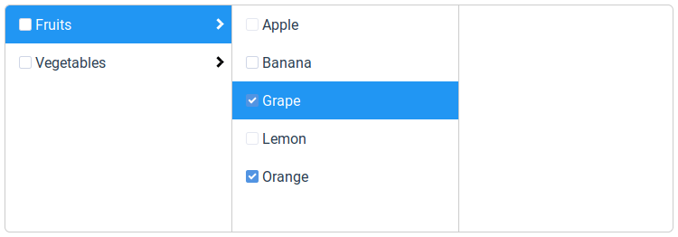

<div align="center" markdown="1">


**A Vue.js component to display hierarchical data (like the MacOS X finder)**

[](https://travis-ci.org/jledentu/vue-finder)
[](https://www.npmjs.com/package/@jledentu/vue-finder)
[](https://codecov.io/gh/jledentu/vue-finder)
[](https://www.codefactor.io/repository/github/jledentu/vue-finder/overview/master)
[](https://github.com/semantic-release/semantic-release)



</div>

## Installation

```
npm install --save @jledentu/vue-finder
```

vue-finder can be used as a module in both CommonJS and ES module environments.
When in non-modular environment, vue-finder will register all the components to vue by itself.

### ES6

```js
import { Finder } from '@jledentu/vue-finder';

export default {
  ...
  components: {
    Finder
  },
  ...
};
```

### CommonJS

```js
//
// You can register a component manually
//
var Vue = require('vue');
var VueFinder = require('@jledentu/vue-finder');

var YourComponent = Vue.extend({
  ...
  components: {
    'vue-finder': VueFinder.Finder
  },
  ...
});
```

### Browser

```html
<script src="path/to/vue/vue.min.js"></script>
<script src="path/to/@jledentu/vue-finder/dist/vue-finder.min.js"></script>
<!-- Components are registered globally -->
```

### After that, you can use it in your templates:

```html
<vue-finder></vue-finder>
```

## Changelog

See the GitHub [release history](https://github.com/jledentu/vue-finder/releases).
